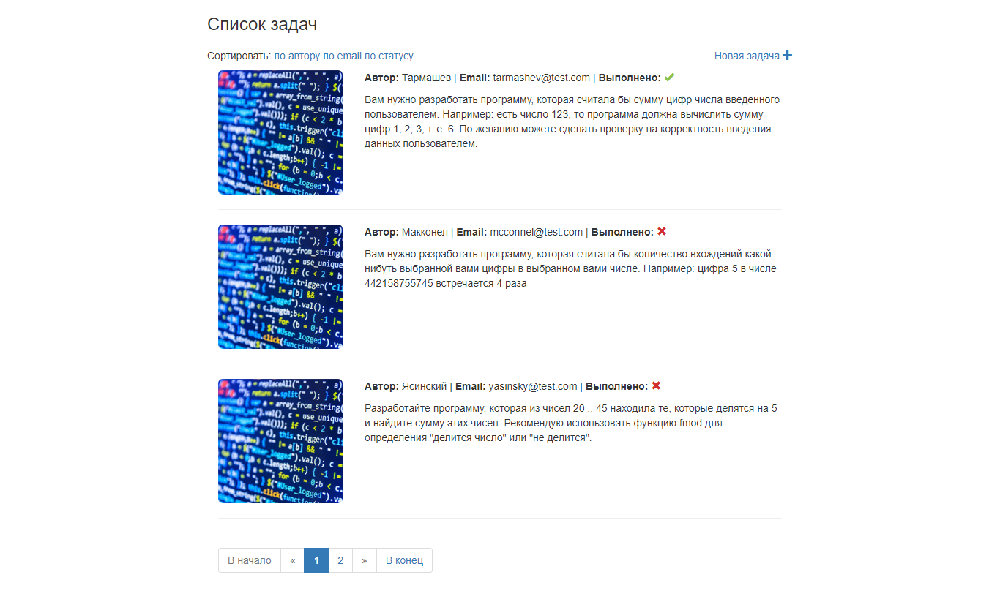
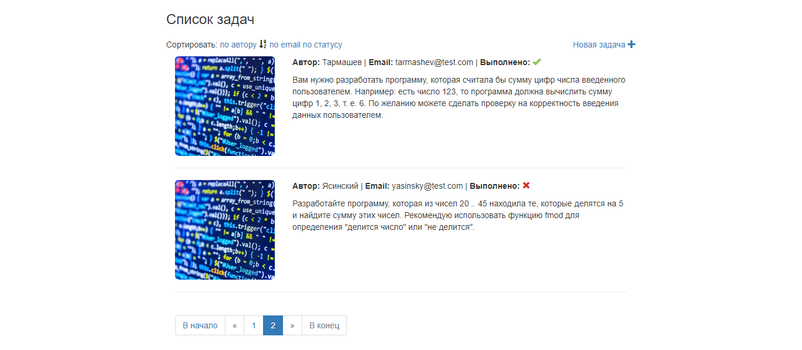
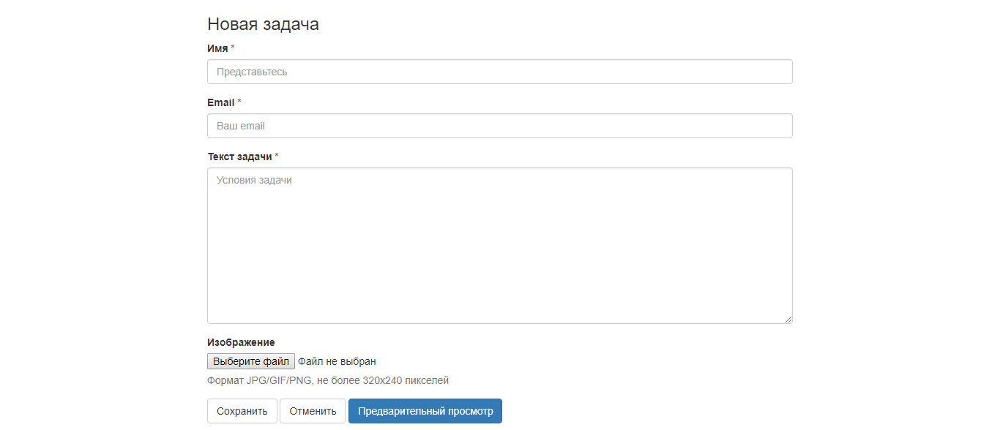
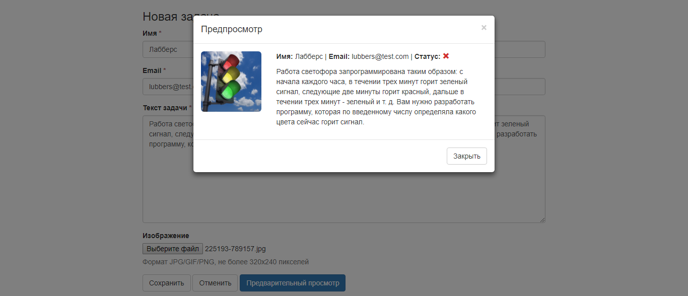
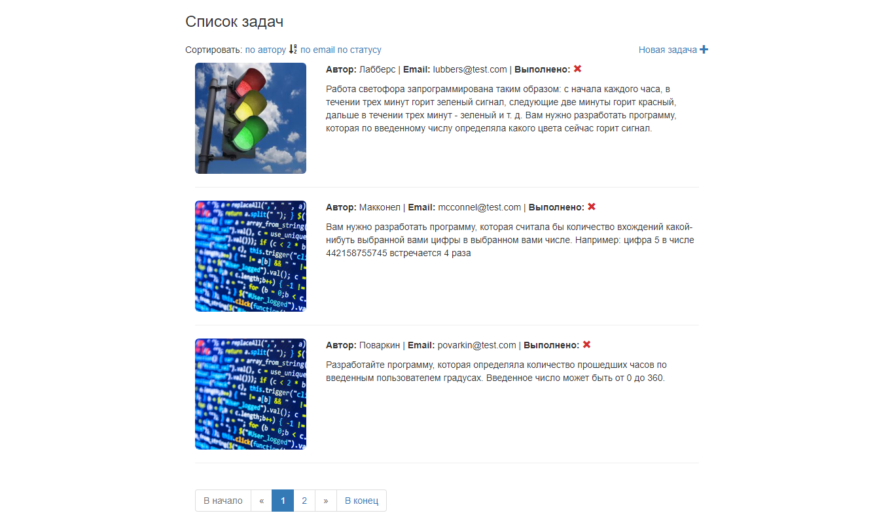
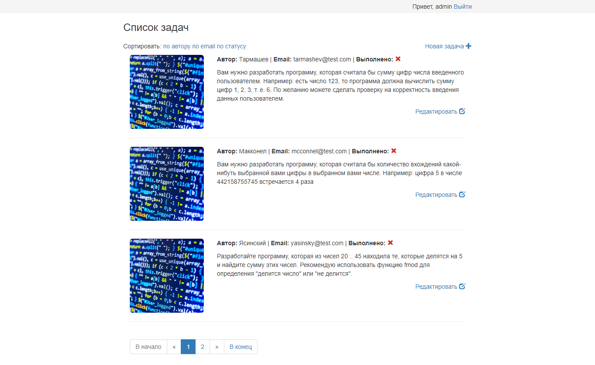
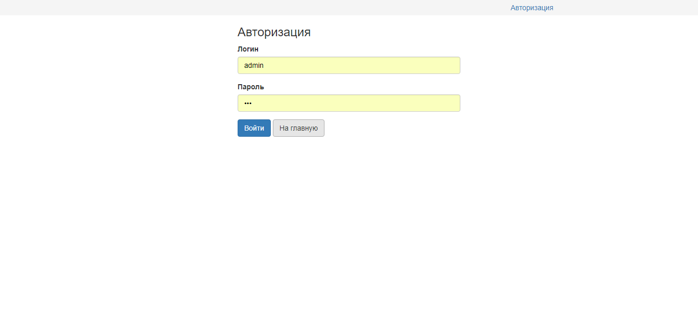
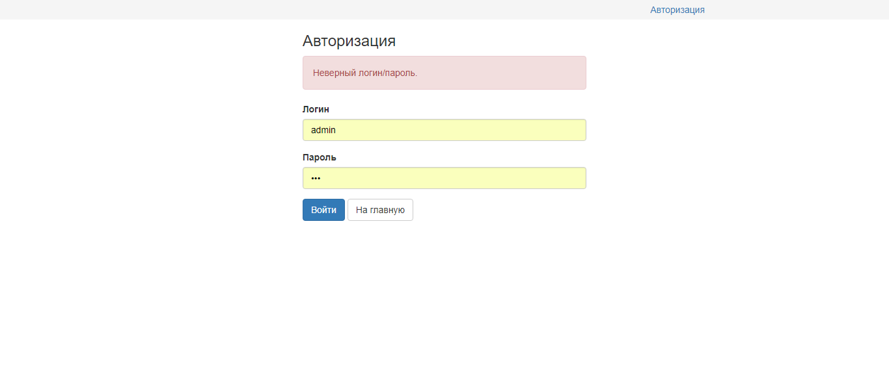
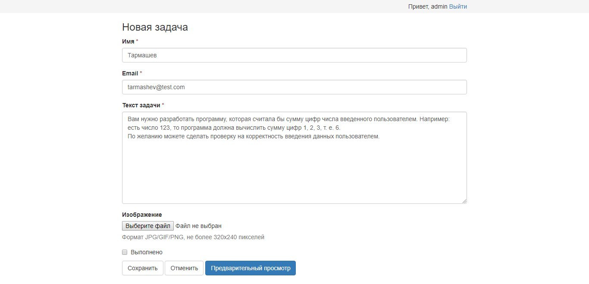

### Задача

Создать приложение-задачник.
Задачи состоят из:
- имени пользователя;
- е-mail;
- текста задачи;
- картинки;

Стартовая страница - список задач с возможностью сортировки (обязательный пункт) по имени пользователя, email и статусу. Вывод задач нужно сделать страницами по 3 штуки (с пагинацией). Видеть список задач и создавать новые может любой посетитель без регистрации. 

Перед сохранением новой задачи можно нажать "Предварительный просмотр" (обязательный пункт), он должен работать без перезагрузки страницы. 

К задаче можно прикрепить картинку. Требования к изображениям - формат JPG/GIF/PNG, не более 320х240 пикселей. При попытке загрузить изображение большего размера, картинка должна быть пропорционально уменьшена до заданных размеров.

Сделайте вход для администратора (логин "admin", пароль "123"). Администратор имеет возможность редактировать текст задачи и поставить галочку о выполнении. Выполненные задачи в общем списке выводятся с соответствующей отметкой.

В приложении нужно с помощью чистого PHP реализовать модель MVC. Фреймворки PHP использовать нельзя, библиотеки - можно. Верстка на bootstrap. К дизайну особых требований нет, но должно выглядеть аккуратно.

### Затраченное время

* Структура MVC - 3 ч
* Постраничная навигация - 2 ч
* Сортировка - 2 ч
* Добавление новой задачи (сохранение, изменение пропорций изображения, предпросмотр) - 3 ч
* Авторизация - 2 ч
* Редактирование задач - 1.5 ч

Итого - 13.5 ч.

### Скриншоты

